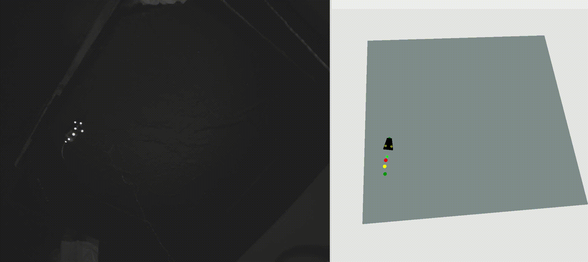

# KISN-pancortical-kinematics
### Data analyses for e-phys and 3D tracking experiments
---------------------------------------------------------------------------------
Code used to generate findings presented in "Behavioral decomposition reveals rich encoding structure employed across neocortex" ([bioRxiv](https://www.biorxiv.org/content/10.1101/2022.02.08.479515v1), 2022). The "Rat 3D Tracking & E-Phys KISN 2020 Dataset", generated for the purposes of this project, can be downloaded at [fig**share**](https://figshare.com/articles/dataset/Rat_3D_Tracking_E-Phys_KISN_2020_Dataset/17903834).

To run the code, download the data and clone the repository in a virtual environment with the installed packages listed in the file requirements.txt. 

For example, to plot spiking cross-correlation examples, one would run:

```
from make_example_plots import PlotExamples
PlotExamples(cch_data_dir='/.../noise_correlations/analyses',
             area_file='synaptic_AA.json',
             cell_pair_id='imec0_cl0185_ch087-imec0_cl0192_ch093',
             sp_profiles_csv=sp_profiles_csv,
             save_dir='/.../Downloads',
             save_fig=False,
             fig_format='svg').plot_spiking_cch(add_prob=True,
                                                fig_size_of_choice=True,
                                                to_normalize=True,
                                                plot_pair_position=False)
```

Tested in PyCharm 2021.3.3 on Ubuntu 20.04 LTS.



